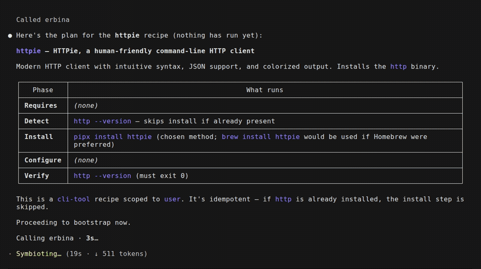

# erbina

> A Claude-Code-only MCP server that bootstraps your dev environment from one
> prompt — install, wire, and **verify** CLI tools and other MCP servers from
> curated recipes, and see where every MCP server lives across your scopes.

[](https://github.com/noahhyden/erbina/actions/workflows/ci.yml)
[](https://github.com/noahhyden/erbina/releases)
[](LICENSE)
[](https://modelcontextprotocol.io)
[](https://code.claude.com)



Named after the Lusitanian goddess of boundaries and crossings — erbina is the
threshold a tool crosses to become part of your environment. Sibling to
[ataegina](https://github.com/noahhyden/ataegina-cli) (goddess of rebirth), which
is also erbina's proof-of-concept recipe #1.

> **The recipe contract is the core idea.** One server, eleven tools, and a curated
> set of **500+ recipes** spanning `cli-tool`s, scope-wiring `mcp-server`s, and
> `profile`s that bundle them (see the [Recipe gallery](#recipe-gallery)). Each is
> one YAML file held to a conformance bar — schema + linter policy + a 100%-covered
> offline suite, plus a weekly job that actually installs it on macOS, Linux, and
> Windows — and adding one is the point.

## Why this exists

Setting up a coding-agent environment is death by a thousand cuts: you install a
CLI, hand-edit a config, add an MCP server — then find out it's in the wrong
*scope* and isn't showing up. Claude Code spreads MCP config across **up to four
files in two apps**, with no single place that knows what's installed where
([anthropics/claude-code#27458](https://github.com/anthropics/claude-code/issues/27458),
[#8288](https://github.com/anthropics/claude-code/issues/8288),
[#5963](https://github.com/anthropics/claude-code/issues/5963)).

erbina makes setup a thing an **agent does for you, and proves worked**:

- **It's an MCP server, so an agent must drive it.** There is no human entry
  point — run it by hand and you get nothing. Nobody mistakes it for a manual
  installer that "should just work."
- **Recipes, not one-shot installs.** Each entry is a contract:
  **detect → install → configure → verify**. Idempotent by construction — it
  detects what's already there and skips it, and success means the tool *runs*,
  not that a line was written to a file. Recipes also **compose** (`requires:`
  prerequisites, `profile`s that bundle a whole set) and cover the **full
  lifecycle**: `update` → re-verify → rollback, `uninstall`, and a `doctor`
  health-check over everything erbina installed.
- **Scope-aware.** It knows about Claude Code's `local` / `project` / `user`
  scopes, wires MCP-server recipes into the right one, and audits all three so
  you finally have one place that answers "what's installed, and where?"
- **Proven, not just written.** On top of the offline suite, a weekly (and
  on-demand) CI job bootstraps recipes *for real* against live package managers on
  **macOS, Linux, and Windows** — so a renamed brew formula, a dead URL, or a bad
  winget id is caught, not shipped.

## Install

erbina is a single Python file run by [`uv`](https://docs.astral.sh/uv/) (it
declares its own dependencies inline — no venv to manage).

```bash
git clone https://github.com/noahhyden/erbina
# register it with Claude Code (use --scope user to make it available everywhere)
claude mcp add erbina --scope user -- uv run --script /absolute/path/to/erbina/server.py
```

Then, in Claude Code, just ask: *"use erbina to set up ataegina"* — the agent
inspects the recipe, shows you exactly what it will run, then bootstraps and
verifies it.

Requirements: `uv` and Claude Code, on macOS, Linux, or Windows. Plus whatever a
recipe's install method needs — typically `brew` on macOS, `winget` on Windows, or
a language toolchain (`cargo` / `go` / `pipx`) or `curl` fallback elsewhere. Every
method is guarded, so only one that actually exists on your machine ever runs.

### Headless / CI usage

In an interactive session `claude mcp add …` (above) handles the trust prompt for
you. A non-interactive `claude -p` run has no prompt to answer, so you load the
server with `--mcp-config` and **pre-approve** erbina's tools with `--allowedTools`
(their names are `mcp__erbina__<tool>`). Write an MCP config once:

```json
// erbina.mcp.json
{ "mcpServers": { "erbina": {
  "command": "uv",
  "args": ["run", "--script", "/absolute/path/to/erbina/server.py"]
} } }
```

```bash
# read-only: discover + inspect (nothing executes)
claude -p "use erbina to list recipes, then inspect ripgrep" \
  --mcp-config erbina.mcp.json --strict-mcp-config \
  --allowedTools mcp__erbina__list_recipes mcp__erbina__inspect_recipe

# install for real (add mcp__erbina__bootstrap to the allowlist)
claude -p "use erbina to bootstrap the modern-unix profile" \
  --mcp-config erbina.mcp.json --strict-mcp-config \
  --allowedTools mcp__erbina__bootstrap
```

`--strict-mcp-config` makes the run use *only* the servers in that file, so it
never picks up your global config. Omit `--allowedTools` and a headless call
can't call any tool — that's the one thing new CI users trip on.

## Tools

| Tool | What it does |
|---|---|
| `list_recipes` | List the curated recipes erbina can bootstrap — each with a `category` and search `tags` so you can tell at a glance what it's for. |
| `search_recipes` | Find a recipe by keyword and/or filter (`category`, `kind`) instead of scanning the whole list — ranked by relevance. E.g. "a JSON tool" or `category="kubernetes"`. |
| `list_categories` | A domain map of the registry — every category with a recipe, how many, and example tools. See what erbina **covers** at a glance, then drill in with `search_recipes(category=…)`. |
| `inspect_recipe` | Show **exactly** what bootstrapping a recipe would run — the consent surface. Nothing executes. |
| `bootstrap` | Run a recipe: detect → install → configure → verify, idempotently. `dry_run=true` returns the full plan without executing. |
| `check_updates` | Read-only report of whether installed tools have newer versions available, for recipes that declare a `version:` block. Pinned tools are flagged and excluded. |
| `update` | Upgrade an installed tool, then **re-run `verify`** as a safety net — on failure it rolls back (if the recipe supports it) or marks the tool broken. `dry_run=true` shows the command first. |
| `pin` | Pin (or unpin) a tool so automatic updates skip it. `update` refuses a pinned tool unless `force=true`. |
| `audit_scopes` | Read-only report of which MCP servers are configured in `local` / `project` / `user` scope, where each lives, and any name shadowed across scopes. |
| `find_dead_mcps` | Health-check every configured MCP server and flag the ones that fail to connect — stale/dead servers, annotated with the scope to remove them from. Read-only. |
| `remove_mcp` | Remove an MCP server by name (e.g. a dead one), auto-resolving its scope. `dry_run=true` shows the `claude mcp remove` command without running it. |
| `doctor` | Health-check the CLI tools erbina has installed (its state manifest): re-run each one's `detect` + `verify` and report healthy / missing / broken. Read-only; the CLI-tool counterpart to `find_dead_mcps`. |
| `uninstall` | Reverse a cli-tool install via the recipe's `uninstall:` block, confirm it's gone (re-run `detect`), and forget it in the state manifest. `dry_run=true` shows the command first. For MCP servers use `remove_mcp`. |

The server's instructions tell the agent to **always inspect (or dry-run) and
show you the commands before executing** — erbina shells out to package managers
with real privileges (it runs as a sibling process, not under Claude Code's Bash
sandbox), so consent before execution is the safety model.

## How a recipe works

A recipe is four phases an agent executes. The proof-of-concept entry,
[`recipes/ataegina.yaml`](recipes/ataegina.yaml):

```yaml
detect:   { command: "ataegina --version", expect_exit: 0 }   # skip install if present
install:                                                       # first guard to pass wins
  methods:
    - { id: homebrew, when: "command -v brew", run: "brew install noahhyden/tap/ataegina" }
    - { id: curl,     when: "command -v curl", run: "curl -fsSL .../install.sh | sh" }
configure: { steps: [ { run: "ataegina init --yes", needs_project_dir: true, optional: true } ] }
verify:   [ { command: "ataegina --version", expect_exit: 0 } ]
```

A `kind: mcp-server` recipe instead wires a server into a chosen scope — its
configure step is `claude mcp add <name> --scope ${scope} -- …`, where `${scope}`
is substituted from the `scope` you pass to `bootstrap`. See
[`recipes/fetch.yaml`](recipes/fetch.yaml). A `kind: profile` recipe installs
nothing itself — it just `requires:` a curated set, so one prompt bootstraps the
whole bundle.

Recipes can also declare optional blocks: `requires:` (prerequisites bootstrapped
first), `version:` + `update:` / `rollback:` (auto-updates, with `latest:` as a
command or the `{ github: owner/repo }` shorthand), and `uninstall:` (teardown).
Because each install method's `when:` guard runs in the host shell, methods are
cross-platform — a `winget` method fires only on Windows, `brew`/`cargo`/`curl`
only where they apply. The full schema is in [SCHEMA.md](SCHEMA.md).

## Auto-updating tools

A recipe can opt into update checks by declaring a `version:` block (an installed
`current` command and a `latest` source) and, optionally, `update:` / `rollback:`
methods. Then:

- **`check_updates`** compares installed vs latest (numeric/pre-release aware, via
  `packaging`) and reports what's out of date — it never claims an update it can't
  parse, skips **pinned** tools, and for a `{ github: … }` source includes a
  release-notes link so you can review before applying.
- **`update`** applies the upgrade and **re-runs `verify`**; if verify fails it
  rolls back to the recorded previous version (when the recipe declares a
  `rollback:` command) or marks the tool broken and returns a plan.
- erbina records what it manages in a small state manifest (`~/.erbina/state.json`)
  — versions, install method, and pins.

Checks are agent-driven; you can also enable an **opt-in** SessionStart hook or a
`/schedule` routine so the agent checks for you and asks before applying anything.
See [AUTO_UPDATE.md](AUTO_UPDATE.md) for the design, the `version:`/`update:`/
`rollback:` schema, and the trigger setup.

## Recipe gallery

The curated registry today — 500+ recipes. Each links to its YAML; `cli-tool`s
install a binary, `mcp-server`s wire a server into a chosen Claude Code scope, and
`profile`s bundle several recipes. (This list is kept in sync with `recipes/` by a
test. The bulk `cli-tool` entries are generated from `scripts/recipe_data.py`.)

<details>
<summary><strong>CLI tools</strong> — the marquee set</summary>

- [`ataegina`](recipes/ataegina.yaml) — collision-free dev environments per git worktree
- [`bat`](recipes/bat.yaml) — a cat clone with syntax highlighting and Git integration
- [`bottom`](recipes/bottom.yaml) — a cross-platform graphical process/system monitor
- [`delta`](recipes/delta.yaml) — a syntax-highlighting pager for git, diff, and grep output
- [`difftastic`](recipes/difftastic.yaml) — a structural (syntax-aware) diff tool
- [`dust`](recipes/dust.yaml) — a more intuitive version of du
- [`eza`](recipes/eza.yaml) — a modern, maintained replacement for ls
- [`fd`](recipes/fd.yaml) — a fast, friendly alternative to find
- [`gh`](recipes/gh.yaml) — GitHub's official command-line tool
- [`httpie`](recipes/httpie.yaml) — a human-friendly command-line HTTP client
- [`hyperfine`](recipes/hyperfine.yaml) — a command-line benchmarking tool
- [`jq`](recipes/jq.yaml) — command-line JSON processor
- [`lazygit`](recipes/lazygit.yaml) — a simple terminal UI for git commands
- [`procs`](recipes/procs.yaml) — a modern replacement for ps
- [`ripgrep`](recipes/ripgrep.yaml) — blazing-fast recursive search
- [`sd`](recipes/sd.yaml) — intuitive find & replace (a friendlier sed)
- [`tealdeer`](recipes/tealdeer.yaml) — a very fast tldr client (simplified man pages)
- [`tokei`](recipes/tokei.yaml) — count your code, quickly
- [`uv`](recipes/uv.yaml) — an extremely fast Python package and project manager
- [`yq`](recipes/yq.yaml) — a portable command-line YAML/JSON/XML processor
- [`zoxide`](recipes/zoxide.yaml) — a smarter cd command that learns your habits

</details>

<details>
<summary><strong>CLI tools</strong> — the full registry (500+, bulk-curated, kept in sync with <code>recipes/</code> by <code>scripts/gen_recipes.py</code>)</summary>

<!-- GENERATED:cli-tools (managed by scripts/gen_recipes.py) -->
- [`ack`](recipes/ack.yaml) — a grep-like search tool optimized for source code
- [`act`](recipes/act.yaml) — run your GitHub Actions locally
- [`ag`](recipes/ag.yaml) — a code-searching tool similar to ack, but faster (`ag`)
- [`age`](recipes/age.yaml) — a simple, modern and secure encryption tool
- [`aichat`](recipes/aichat.yaml) — all-in-one LLM CLI tool
- [`alex`](recipes/alex.yaml) — catch insensitive, inconsiderate writing
- [`ali`](recipes/ali.yaml) — generate HTTP load and plot the results in real-time
- [`angle-grinder`](recipes/angle-grinder.yaml) — slice and dice logs on the command line (`agrind`)
- [`ansible`](recipes/ansible.yaml) — a radically simple IT automation platform
- [`argocd`](recipes/argocd.yaml) — the CLI for Argo CD, declarative GitOps continuous delivery for Kubernetes
- [`aria2`](recipes/aria2.yaml) — a lightweight multi-protocol and multi-source download utility (`aria2c`)
- [`artillery`](recipes/artillery.yaml) — a modern load testing and smoke testing toolkit
- [`asciidoctor`](recipes/asciidoctor.yaml) — a fast, open-source text processor for converting AsciiDoc content
- [`asciinema`](recipes/asciinema.yaml) — record and share terminal sessions
- [`asdf`](recipes/asdf.yaml) — manage multiple runtime versions with a single CLI tool
- [`ast-grep`](recipes/ast-grep.yaml) — a fast and polyglot tool for code structural search, lint and rewriting
- [`atmos`](recipes/atmos.yaml) — universal tool for DevOps and cloud automation
- [`atuin`](recipes/atuin.yaml) — magical shell history
- [`autoconf`](recipes/autoconf.yaml) — a tool for producing configure scripts for building software
- [`autojump`](recipes/autojump.yaml) — a faster way to navigate your filesystem
- [`automake`](recipes/automake.yaml) — a tool for automatically generating Makefile.in files
- [`autopep8`](recipes/autopep8.yaml) — automatically formats Python code to conform to the PEP 8 style guide
- [`aws-sam-cli`](recipes/aws-sam-cli.yaml) — build and test serverless applications with the AWS Serverless Application Model (`sam`)
- [`aws-vault`](recipes/aws-vault.yaml) — a vault for securely storing and accessing AWS credentials
- [`awscli`](recipes/awscli.yaml) — the AWS Command Line Interface (`aws`)
- [`axel`](recipes/axel.yaml) — a light command-line download accelerator
- [`azure-cli`](recipes/azure-cli.yaml) — the command-line tools for managing Azure resources (`az`)
- [`bacon`](recipes/bacon.yaml) — a background rust code checker
- [`bandit`](recipes/bandit.yaml) — a tool designed to find common security issues in Python code
- [`bandwhich`](recipes/bandwhich.yaml) — terminal bandwidth utilization tool
- [`bash`](recipes/bash.yaml) — the GNU Bourne-Again SHell
- [`bats`](recipes/bats.yaml) — Bash Automated Testing System
- [`bc`](recipes/bc.yaml) — an arbitrary-precision calculator language
- [`beets`](recipes/beets.yaml) — the music geek's media organizer (`beet`)
- [`biome`](recipes/biome.yaml) — a performant toolchain for web projects: format, lint and more
- [`black`](recipes/black.yaml) — the uncompromising Python code formatter
- [`borg`](recipes/borg.yaml) — deduplicating archiver with compression and encryption
- [`bpython`](recipes/bpython.yaml) — a fancy interface to the Python interpreter
- [`broot`](recipes/broot.yaml) — a new way to see and navigate directory trees
- [`brotli`](recipes/brotli.yaml) — a generic-purpose lossless compression algorithm
- [`btop`](recipes/btop.yaml) — a monitor of resources
- [`buf`](recipes/buf.yaml) — the best way to work with Protocol Buffers
- [`buku`](recipes/buku.yaml) — a powerful bookmark manager and mini web-tagger
- [`bun`](recipes/bun.yaml) — an incredibly fast JavaScript runtime, bundler, transpiler and package manager
- [`caddy`](recipes/caddy.yaml) — fast and extensible multi-platform web server with automatic HTTPS
- [`calcurse`](recipes/calcurse.yaml) — a text-based calendar and scheduling application
- [`carthage`](recipes/carthage.yaml) — a simple, decentralized dependency manager for Cocoa
- [`ccache`](recipes/ccache.yaml) — a fast C/C++ compiler cache
- [`cdk`](recipes/cdk.yaml) — define cloud infrastructure using familiar programming languages (`cdk`)
- [`chafa`](recipes/chafa.yaml) — image-to-text converter for terminal graphics
- [`cheat`](recipes/cheat.yaml) — create and view interactive cheatsheets on the command line
- [`checkov`](recipes/checkov.yaml) — prevent cloud misconfigurations by scanning infrastructure as code
- [`chezmoi`](recipes/chezmoi.yaml) — manage your dotfiles across multiple diverse machines, securely
- [`choose`](recipes/choose.yaml) — a human-friendly and fast alternative to cut and (sometimes) awk
- [`clang-format`](recipes/clang-format.yaml) — a tool to format C, C++, Objective-C and related code
- [`cloudflared`](recipes/cloudflared.yaml) — Cloudflare Tunnel client
- [`cmake`](recipes/cmake.yaml) — a cross-platform family of tools designed to build, test and package software
- [`cocoapods`](recipes/cocoapods.yaml) — the dependency manager for Swift and Objective-C Cocoa projects (`pod`)
- [`code2prompt`](recipes/code2prompt.yaml) — a CLI tool to convert your codebase into a single LLM prompt
- [`codespell`](recipes/codespell.yaml) — fix common misspellings in text files and source code
- [`colima`](recipes/colima.yaml) — container runtimes on macOS (and Linux) with minimal setup
- [`colordiff`](recipes/colordiff.yaml) — a tool to colorize diff output
- [`commitizen`](recipes/commitizen.yaml) — create committing rules, bump versions and generate changelogs (`cz`)
- [`commitlint`](recipes/commitlint.yaml) — lint commit messages against your commit convention
- [`composer`](recipes/composer.yaml) — dependency manager for PHP
- [`concurrently`](recipes/concurrently.yaml) — run multiple commands concurrently
- [`conftest`](recipes/conftest.yaml) — write tests against structured configuration data using OPA/Rego
- [`consul`](recipes/consul.yaml) — service networking across any cloud
- [`cookiecutter`](recipes/cookiecutter.yaml) — a command-line utility that creates projects from templates
- [`cosign`](recipes/cosign.yaml) — container signing, verification and storage in an OCI registry
- [`cpanminus`](recipes/cpanminus.yaml) — get, unpack, build and install modules from CPAN (`cpanm`)
- [`cppcheck`](recipes/cppcheck.yaml) — a static analysis tool for C/C++ code
- [`crane`](recipes/crane.yaml) — a tool for interacting with remote images and registries
- [`croc`](recipes/croc.yaml) — securely send files and folders from one computer to another
- [`crystal`](recipes/crystal.yaml) — a language for humans and computers, with Ruby-like syntax and native speed
- [`cspell`](recipes/cspell.yaml) — a spell checker for code
- [`csvkit`](recipes/csvkit.yaml) — a suite of command-line tools for converting to and working with CSV (`csvlook`)
- [`csvtk`](recipes/csvtk.yaml) — a cross-platform, efficient and practical CSV/TSV toolkit
- [`ctop`](recipes/ctop.yaml) — top-like interface for container metrics
- [`curl`](recipes/curl.yaml) — a command-line tool for transferring data with URLs
- [`dasel`](recipes/dasel.yaml) — select, put and delete data from JSON, TOML, YAML, XML and CSV
- [`datamash`](recipes/datamash.yaml) — a command-line program which performs basic numeric, textual and statistical operations on input textual data
- [`datasette`](recipes/datasette.yaml) — an open source multi-tool for exploring and publishing data
- [`dbmate`](recipes/dbmate.yaml) — a lightweight, framework-agnostic database migration tool
- [`degit`](recipes/degit.yaml) — straightforward project scaffolding
- [`delve`](recipes/delve.yaml) — a debugger for the Go programming language (`dlv`)
- [`deno`](recipes/deno.yaml) — a modern runtime for JavaScript and TypeScript
- [`devspace`](recipes/devspace.yaml) — a client-only developer tool for fast Kubernetes development
- [`direnv`](recipes/direnv.yaml) — unclutter your .profile with per-directory environments
- [`diskonaut`](recipes/diskonaut.yaml) — terminal disk space navigator
- [`dive`](recipes/dive.yaml) — a tool for exploring a docker image and layer contents
- [`doctl`](recipes/doctl.yaml) — the official command-line interface for the DigitalOcean API
- [`doctoc`](recipes/doctoc.yaml) — generates a table of contents for markdown files
- [`dog`](recipes/dog.yaml) — a command-line DNS client
- [`doggo`](recipes/doggo.yaml) — a modern command-line DNS client (like dig) written in Go
- [`dos2unix`](recipes/dos2unix.yaml) — text file format converter between DOS/Mac and Unix line endings
- [`dotenv-linter`](recipes/dotenv-linter.yaml) — a lightning-fast linter for .env files
- [`doxygen`](recipes/doxygen.yaml) — the de facto standard tool for generating documentation from annotated C++ sources
- [`dprint`](recipes/dprint.yaml) — a pluggable and configurable code formatting platform
- [`dua`](recipes/dua.yaml) — a tool to conveniently learn about disk usage
- [`duckdb`](recipes/duckdb.yaml) — an in-process SQL OLAP database management system
- [`duf`](recipes/duf.yaml) — disk usage/free utility, a better df alternative
- [`dysk`](recipes/dysk.yaml) — a linux utility to get information on filesystems, like df but better
- [`eksctl`](recipes/eksctl.yaml) — the official CLI for Amazon EKS
- [`elixir`](recipes/elixir.yaml) — a dynamic, functional language for building scalable and maintainable applications
- [`esbuild`](recipes/esbuild.yaml) — an extremely fast JavaScript bundler and minifier
- [`eslint`](recipes/eslint.yaml) — find and fix problems in your JavaScript code
- [`eva`](recipes/eva.yaml) — a simple calculator REPL, similar to bc
- [`exiftool`](recipes/exiftool.yaml) — read, write and edit meta information in a wide variety of files
- [`fastfetch`](recipes/fastfetch.yaml) — a fast, feature-rich system information tool
- [`fastlane`](recipes/fastlane.yaml) — the easiest way to automate building and releasing iOS and Android apps
- [`fastmod`](recipes/fastmod.yaml) — a fast partial replacement for the codemod tool
- [`fblog`](recipes/fblog.yaml) — a small command-line JSON log viewer
- [`fclones`](recipes/fclones.yaml) — an efficient duplicate file finder and remover
- [`fend`](recipes/fend.yaml) — an arbitrary-precision unit-aware calculator
- [`ffmpeg`](recipes/ffmpeg.yaml) — a complete solution to record, convert and stream audio and video
- [`ffuf`](recipes/ffuf.yaml) — fast web fuzzer written in Go
- [`firebase-tools`](recipes/firebase-tools.yaml) — the Firebase command-line interface (`firebase`)
- [`fish`](recipes/fish.yaml) — the friendly interactive shell
- [`flac`](recipes/flac.yaml) — the reference implementation of the Free Lossless Audio Codec
- [`flake8`](recipes/flake8.yaml) — the modular source code checker for Python
- [`flatbuffers`](recipes/flatbuffers.yaml) — a cross-platform serialization library for memory-efficient data (`flatc`)
- [`flyctl`](recipes/flyctl.yaml) — the command-line interface for Fly.io
- [`fnm`](recipes/fnm.yaml) — fast and simple Node.js version manager
- [`fq`](recipes/fq.yaml) — jq for binary formats
- [`freeze`](recipes/freeze.yaml) — generate images of code and terminal output
- [`fswatch`](recipes/fswatch.yaml) — a cross-platform file change monitor with multiple backends
- [`fx`](recipes/fx.yaml) — terminal JSON viewer and processor
- [`fzf`](recipes/fzf.yaml) — a command-line fuzzy finder
- [`gallery-dl`](recipes/gallery-dl.yaml) — download image galleries and collections from several image hosting sites
- [`gawk`](recipes/gawk.yaml) — the GNU implementation of the AWK programming language
- [`gcovr`](recipes/gcovr.yaml) — generate code coverage reports with gcc/gcov
- [`gdu`](recipes/gdu.yaml) — a fast disk usage analyzer with a console interface written in Go
- [`genact`](recipes/genact.yaml) — a nonsense activity generator
- [`ghostscript`](recipes/ghostscript.yaml) — an interpreter for PostScript and PDF (`gs`)
- [`ghq`](recipes/ghq.yaml) — manage remote repository clones
- [`gifski`](recipes/gifski.yaml) — the highest-quality GIF encoder based on pngquant
- [`git-absorb`](recipes/git-absorb.yaml) — automatically absorb staged changes into your recent commits
- [`git-cliff`](recipes/git-cliff.yaml) — a highly customizable changelog generator
- [`git-filter-repo`](recipes/git-filter-repo.yaml) — quickly rewrite git repository history
- [`git-lfs`](recipes/git-lfs.yaml) — git extension for versioning large files
- [`git-town`](recipes/git-town.yaml) — generic, high-level git workflow support
- [`gitleaks`](recipes/gitleaks.yaml) — detect secrets in code
- [`gitlint`](recipes/gitlint.yaml) — a git commit message linter written in Python
- [`gitmoji`](recipes/gitmoji.yaml) — an interactive command-line tool for using emojis on commits (`gitmoji`)
- [`gitu`](recipes/gitu.yaml) — a TUI git client inspired by Magit
- [`gitui`](recipes/gitui.yaml) — blazing-fast terminal UI for git
- [`glab`](recipes/glab.yaml) — an open-source GitLab CLI tool
- [`glances`](recipes/glances.yaml) — a cross-platform system monitoring tool
- [`gleam`](recipes/gleam.yaml) — a friendly language for building type-safe systems that scale
- [`glow`](recipes/glow.yaml) — render markdown on the CLI, with style
- [`gnuplot`](recipes/gnuplot.yaml) — a portable command-line driven graphing utility
- [`goaccess`](recipes/goaccess.yaml) — a real-time web log analyzer and interactive viewer
- [`gobuster`](recipes/gobuster.yaml) — directory/file, DNS and vhost busting tool
- [`golangci-lint`](recipes/golangci-lint.yaml) — fast linters runner for Go
- [`gopass`](recipes/gopass.yaml) — the slightly more awesome standard unix password manager for teams
- [`goreleaser`](recipes/goreleaser.yaml) — deliver Go binaries as fast and easily as possible
- [`gpg-tui`](recipes/gpg-tui.yaml) — a terminal user interface for GnuPG
- [`gping`](recipes/gping.yaml) — ping, but with a graph
- [`gradle`](recipes/gradle.yaml) — an open-source build automation tool focused on flexibility and performance
- [`graphviz`](recipes/graphviz.yaml) — graph visualization software (`dot`)
- [`grex`](recipes/grex.yaml) — generate regular expressions from user-provided examples
- [`gron`](recipes/gron.yaml) — make JSON greppable
- [`grpcurl`](recipes/grpcurl.yaml) — like cURL, but for gRPC
- [`grype`](recipes/grype.yaml) — a vulnerability scanner for container images and filesystems
- [`gum`](recipes/gum.yaml) — a tool for glamorous shell scripts
- [`hadolint`](recipes/hadolint.yaml) — a smarter Dockerfile linter
- [`hatch`](recipes/hatch.yaml) — a modern, extensible Python project manager
- [`hcloud`](recipes/hcloud.yaml) — a command-line interface for Hetzner Cloud
- [`helix`](recipes/helix.yaml) — a post-modern modal text editor
- [`helm`](recipes/helm.yaml) — the Kubernetes package manager
- [`helmfile`](recipes/helmfile.yaml) — deploy Kubernetes Helm charts declaratively
- [`hexyl`](recipes/hexyl.yaml) — a command-line hex viewer
- [`hgrep`](recipes/hgrep.yaml) — human-friendly grep with a rich display
- [`hlint`](recipes/hlint.yaml) — a tool for suggesting possible improvements to Haskell code
- [`hostctl`](recipes/hostctl.yaml) — a CLI tool to manage /etc/hosts with ease
- [`howdoi`](recipes/howdoi.yaml) — instant coding answers via the command line
- [`htmlhint`](recipes/htmlhint.yaml) — the static code analysis tool you need for your HTML
- [`htmlq`](recipes/htmlq.yaml) — like jq, but for HTML
- [`htop`](recipes/htop.yaml) — an interactive process viewer
- [`http-server`](recipes/http-server.yaml) — a simple, zero-configuration command-line HTTP server
- [`hugo`](recipes/hugo.yaml) — the world's fastest framework for building websites
- [`hurl`](recipes/hurl.yaml) — run and test HTTP requests with plain text
- [`hwatch`](recipes/hwatch.yaml) — a modern alternative to the watch command that records execution results
- [`icdiff`](recipes/icdiff.yaml) — improved colored diff, side-by-side
- [`imagemagick`](recipes/imagemagick.yaml) — create, edit, compose or convert digital images (`magick`)
- [`infracost`](recipes/infracost.yaml) — cloud cost estimates for Terraform in pull requests
- [`iperf3`](recipes/iperf3.yaml) — a TCP, UDP and SCTP network bandwidth measurement tool
- [`ipython`](recipes/ipython.yaml) — a powerful interactive Python shell
- [`isort`](recipes/isort.yaml) — a Python utility to sort imports alphabetically and automatically
- [`jaq`](recipes/jaq.yaml) — a jq clone focused on correctness, speed and simplicity
- [`jbang`](recipes/jbang.yaml) — unleash the power of Java for scripting
- [`jc`](recipes/jc.yaml) — convert the output of many CLI tools and file types to JSON
- [`jekyll`](recipes/jekyll.yaml) — a blog-aware static site generator in Ruby
- [`jenv`](recipes/jenv.yaml) — manage your Java environment
- [`jless`](recipes/jless.yaml) — a command-line JSON viewer
- [`jnv`](recipes/jnv.yaml) — an interactive JSON filter using jq
- [`jo`](recipes/jo.yaml) — a small utility to create JSON objects
- [`joshuto`](recipes/joshuto.yaml) — a ranger-like terminal file manager written in Rust
- [`jpegoptim`](recipes/jpegoptim.yaml) — utility to optimize and compress JPEG files
- [`json-server`](recipes/json-server.yaml) — get a full fake REST API with zero coding in less than 30 seconds
- [`julia`](recipes/julia.yaml) — a high-level, high-performance dynamic language for technical computing
- [`jupytext`](recipes/jupytext.yaml) — Jupyter notebooks as markdown documents, Julia, Python or R scripts
- [`just`](recipes/just.yaml) — a handy command runner
- [`k3d`](recipes/k3d.yaml) — little helper to run k3s in Docker
- [`k6`](recipes/k6.yaml) — a modern load testing tool for engineering teams
- [`k9s`](recipes/k9s.yaml) — Kubernetes CLI to manage your clusters in style
- [`kalker`](recipes/kalker.yaml) — a scientific calculator that supports math-like syntax
- [`kdash`](recipes/kdash.yaml) — a simple and fast dashboard for Kubernetes
- [`khal`](recipes/khal.yaml) — a standards-based CLI and terminal calendar program
- [`kind`](recipes/kind.yaml) — Kubernetes IN Docker
- [`kmon`](recipes/kmon.yaml) — Linux kernel manager and activity monitor
- [`ko`](recipes/ko.yaml) — build and deploy Go applications on Kubernetes
- [`kompose`](recipes/kompose.yaml) — go from Docker Compose to Kubernetes
- [`kondo`](recipes/kondo.yaml) — cleans dependencies and build artifacts from your projects
- [`kopia`](recipes/kopia.yaml) — a fast and secure open-source backup/restore tool
- [`ktlint`](recipes/ktlint.yaml) — an anti-bikeshedding Kotlin linter with built-in formatter
- [`kube-linter`](recipes/kube-linter.yaml) — a static analysis tool that checks Kubernetes YAML and Helm charts
- [`kubeconform`](recipes/kubeconform.yaml) — a fast Kubernetes manifest validation tool
- [`kubectl`](recipes/kubectl.yaml) — the Kubernetes command-line tool
- [`kubectx`](recipes/kubectx.yaml) — faster switching between Kubernetes contexts
- [`kubescape`](recipes/kubescape.yaml) — a Kubernetes security platform for scanning clusters, YAML files and Helm charts
- [`kubeseal`](recipes/kubeseal.yaml) — a CLI to encrypt secrets into SealedSecrets for Kubernetes
- [`kustomize`](recipes/kustomize.yaml) — customization of Kubernetes YAML configurations
- [`lazydocker`](recipes/lazydocker.yaml) — a simple terminal UI for docker and docker-compose
- [`lefthook`](recipes/lefthook.yaml) — a fast and powerful git hooks manager
- [`lerna`](recipes/lerna.yaml) — a tool for managing JavaScript projects with multiple packages
- [`lighthouse`](recipes/lighthouse.yaml) — automated auditing, performance metrics and best practices for the web
- [`litecli`](recipes/litecli.yaml) — a command-line client for SQLite with auto-completion and syntax highlighting
- [`lnav`](recipes/lnav.yaml) — the logfile navigator
- [`localstack`](recipes/localstack.yaml) — a fully functional local cloud stack emulating AWS
- [`localtunnel`](recipes/localtunnel.yaml) — expose your localhost to the world (`lt`)
- [`locust`](recipes/locust.yaml) — a modern load testing framework, define user behaviour with Python code
- [`lolcat`](recipes/lolcat.yaml) — rainbows and unicorns in your terminal
- [`lsd`](recipes/lsd.yaml) — the next-gen ls command
- [`luarocks`](recipes/luarocks.yaml) — the package manager for Lua modules
- [`lz4`](recipes/lz4.yaml) — extremely fast lossless compression algorithm
- [`macchina`](recipes/macchina.yaml) — a fast, minimal and customizable system information tool
- [`magic-wormhole`](recipes/magic-wormhole.yaml) — get things from one computer to another, safely
- [`markdownlint-cli2`](recipes/markdownlint-cli2.yaml) — a fast, flexible, configuration-based command-line interface for linting markdown
- [`mask`](recipes/mask.yaml) — a CLI task runner defined by a simple markdown file
- [`maven`](recipes/maven.yaml) — a build automation and project management tool for Java (`mvn`)
- [`mc`](recipes/mc.yaml) — a modern replacement for ls, cp, mirror and more for object storage (`mc`)
- [`mcfly`](recipes/mcfly.yaml) — an intelligent shell history search
- [`mdbook`](recipes/mdbook.yaml) — create book-like documentation from markdown files
- [`mdcat`](recipes/mdcat.yaml) — cat for markdown
- [`mediainfo`](recipes/mediainfo.yaml) — display technical and tag data for video and audio files
- [`meson`](recipes/meson.yaml) — a fast and user-friendly build system
- [`micro`](recipes/micro.yaml) — a modern and intuitive terminal-based text editor
- [`miller`](recipes/miller.yaml) — like awk, sed, cut, join and sort for CSV, TSV and JSON (`mlr`)
- [`minikube`](recipes/minikube.yaml) — run Kubernetes locally
- [`miniserve`](recipes/miniserve.yaml) — a small, self-contained static file server
- [`mise`](recipes/mise.yaml) — the front-end to your dev env
- [`mitmproxy`](recipes/mitmproxy.yaml) — an interactive HTTPS proxy for intercepting, inspecting and modifying traffic
- [`mkcert`](recipes/mkcert.yaml) — a simple tool for making locally-trusted development certificates
- [`mkdocs`](recipes/mkdocs.yaml) — project documentation with markdown
- [`mkvtoolnix`](recipes/mkvtoolnix.yaml) — tools to create, alter and inspect Matroska files (`mkvmerge`)
- [`mob`](recipes/mob.yaml) — a fast way to switch between roles when doing remote mob programming
- [`mods`](recipes/mods.yaml) — AI on the command line
- [`mongosh`](recipes/mongosh.yaml) — the MongoDB Shell, a modern command-line interface for MongoDB
- [`mosh`](recipes/mosh.yaml) — the mobile shell, a remote terminal application that supports roaming
- [`mprocs`](recipes/mprocs.yaml) — run multiple commands in parallel with a TUI
- [`mtr`](recipes/mtr.yaml) — a network diagnostic tool combining ping and traceroute
- [`mycli`](recipes/mycli.yaml) — a command line client for MySQL with auto-completion and syntax highlighting
- [`mypy`](recipes/mypy.yaml) — optional static typing for Python
- [`nano`](recipes/nano.yaml) — a small, friendly text editor for the terminal
- [`navi`](recipes/navi.yaml) — an interactive cheatsheet tool for the CLI
- [`nbdime`](recipes/nbdime.yaml) — tools for diffing and merging of Jupyter notebooks
- [`ncdu`](recipes/ncdu.yaml) — NCurses disk usage
- [`neovim`](recipes/neovim.yaml) — hyperextensible Vim-based text editor (`nvim`)
- [`nerdctl`](recipes/nerdctl.yaml) — contaiNERD CTL, a Docker-compatible CLI for containerd
- [`netlify`](recipes/netlify.yaml) — the command-line interface for Netlify
- [`newman`](recipes/newman.yaml) — a command-line collection runner for Postman
- [`nim`](recipes/nim.yaml) — an efficient, expressive, elegant statically typed compiled language
- [`ninja`](recipes/ninja.yaml) — a small build system with a focus on speed
- [`nmap`](recipes/nmap.yaml) — the network mapper, a utility for network discovery and security auditing
- [`nodemon`](recipes/nodemon.yaml) — monitor for changes and automatically restart your node app
- [`nomad`](recipes/nomad.yaml) — an easy-to-use, flexible, and performant workload orchestrator
- [`nox`](recipes/nox.yaml) — flexible test automation with Python
- [`npkill`](recipes/npkill.yaml) — easily find and remove old and heavy node_modules folders
- [`npm-check-updates`](recipes/npm-check-updates.yaml) — upgrade your package.json dependencies to the latest versions (`ncu`)
- [`nuclei`](recipes/nuclei.yaml) — fast and customizable vulnerability scanner based on simple YAML templates
- [`numbat`](recipes/numbat.yaml) — a statically typed programming language for scientific computations with units
- [`nushell`](recipes/nushell.yaml) — a new type of shell
- [`ocrmypdf`](recipes/ocrmypdf.yaml) — adds an OCR text layer to scanned PDF files
- [`octave`](recipes/octave.yaml) — a high-level language primarily intended for numerical computations
- [`oha`](recipes/oha.yaml) — HTTP load generator with a realtime TUI
- [`ollama`](recipes/ollama.yaml) — get up and running with large language models locally
- [`onefetch`](recipes/onefetch.yaml) — a git repository summary in your terminal
- [`opa`](recipes/opa.yaml) — Open Policy Agent, general-purpose policy engine
- [`opam`](recipes/opam.yaml) — the OCaml package manager
- [`opentofu`](recipes/opentofu.yaml) — an open-source Terraform-compatible infrastructure as code tool
- [`oras`](recipes/oras.yaml) — OCI registry as storage
- [`ormolu`](recipes/ormolu.yaml) — a formatter for Haskell source code
- [`ouch`](recipes/ouch.yaml) — painless compression and decompression on the command line
- [`ov`](recipes/ov.yaml) — a feature-rich terminal pager
- [`oxipng`](recipes/oxipng.yaml) — a multithreaded lossless PNG compression optimizer
- [`pa11y`](recipes/pa11y.yaml) — your automated accessibility testing pal
- [`packer`](recipes/packer.yaml) — build automated machine images
- [`pandoc`](recipes/pandoc.yaml) — a universal document converter
- [`papermill`](recipes/papermill.yaml) — parameterize, execute and analyze Jupyter notebooks
- [`parallel`](recipes/parallel.yaml) — GNU parallel, a shell tool for executing jobs in parallel
- [`parcel`](recipes/parcel.yaml) — the zero-configuration build tool for the web
- [`pastel`](recipes/pastel.yaml) — a tool to generate, analyze, convert and manipulate colors
- [`pdm`](recipes/pdm.yaml) — a modern Python package and dependency manager supporting the latest PEP standards
- [`pgcli`](recipes/pgcli.yaml) — a command line interface for Postgres with auto-completion and syntax highlighting
- [`pigz`](recipes/pigz.yaml) — a parallel implementation of gzip for modern multi-processor machines
- [`pip-audit`](recipes/pip-audit.yaml) — audit Python environments and dependency trees for known vulnerabilities
- [`pipdeptree`](recipes/pipdeptree.yaml) — display a dependency tree of installed Python packages
- [`pipenv`](recipes/pipenv.yaml) — Python development workflow for humans
- [`pipx`](recipes/pipx.yaml) — install and run Python applications in isolated environments
- [`pkg-config`](recipes/pkg-config.yaml) — a helper tool used when compiling applications and libraries
- [`playwright`](recipes/playwright.yaml) — reliable end-to-end testing for modern web apps
- [`pm2`](recipes/pm2.yaml) — a production process manager for Node.js applications with a built-in load balancer
- [`pngquant`](recipes/pngquant.yaml) — a command-line utility to convert 24/32-bit PNGs to 8-bit paletted PNGs
- [`pnpm`](recipes/pnpm.yaml) — fast, disk space-efficient package manager
- [`poetry`](recipes/poetry.yaml) — Python packaging and dependency management made easy
- [`popeye`](recipes/popeye.yaml) — a Kubernetes cluster resource sanitizer
- [`pre-commit`](recipes/pre-commit.yaml) — a framework for managing multi-language pre-commit hooks
- [`presenterm`](recipes/presenterm.yaml) — markdown terminal slideshows
- [`prettier`](recipes/prettier.yaml) — an opinionated code formatter
- [`prisma`](recipes/prisma.yaml) — next-generation Node.js and TypeScript ORM
- [`proselint`](recipes/proselint.yaml) — a linter for prose
- [`protobuf`](recipes/protobuf.yaml) — Protocol Buffers, Google's data interchange format (`protoc`)
- [`protolint`](recipes/protolint.yaml) — a pluggable linter and fixer to enforce Protocol Buffer style and conventions
- [`pspg`](recipes/pspg.yaml) — a unix pager optimized for psql and other tabular output
- [`ptpython`](recipes/ptpython.yaml) — a better Python REPL
- [`pueue`](recipes/pueue.yaml) — a command-line task management tool for sequential and parallel execution
- [`pulumi`](recipes/pulumi.yaml) — infrastructure as code in your favorite language
- [`pv`](recipes/pv.yaml) — pipe viewer, monitor the progress of data through a pipe
- [`pyenv`](recipes/pyenv.yaml) — simple Python version management
- [`pyinstaller`](recipes/pyinstaller.yaml) — bundles a Python application and all its dependencies into a single package
- [`pylint`](recipes/pylint.yaml) — a static code analyser for Python
- [`pyright`](recipes/pyright.yaml) — a fast static type checker for Python
- [`qpdf`](recipes/qpdf.yaml) — a command-line program that does structural, content-preserving transformations on PDF files
- [`qsv`](recipes/qsv.yaml) — a blazing-fast CSV data-wrangling toolkit
- [`r`](recipes/r.yaml) — a free software environment for statistical computing and graphics (`R`)
- [`radon`](recipes/radon.yaml) — various code metrics for Python code
- [`ranger`](recipes/ranger.yaml) — a VIM-inspired file manager for the console
- [`rav1e`](recipes/rav1e.yaml) — the fastest and safest AV1 encoder
- [`rbenv`](recipes/rbenv.yaml) — manage your app's Ruby environment
- [`rclone`](recipes/rclone.yaml) — rsync for cloud storage
- [`redis`](recipes/redis.yaml) — an in-memory data store; ships the `redis-cli` client
- [`release-it`](recipes/release-it.yaml) — automate versioning and package publishing
- [`restic`](recipes/restic.yaml) — fast, secure, efficient backup program
- [`rich-cli`](recipes/rich-cli.yaml) — a command-line toolbox for fancy output (`rich`)
- [`ripsecrets`](recipes/ripsecrets.yaml) — a command-line tool to prevent committing secret keys into your source code
- [`rlwrap`](recipes/rlwrap.yaml) — a readline wrapper for any command
- [`rnr`](recipes/rnr.yaml) — a command-line tool to batch-rename files and directories
- [`rollup`](recipes/rollup.yaml) — a module bundler for JavaScript
- [`rsync`](recipes/rsync.yaml) — a fast, versatile, remote (and local) file-copying tool
- [`rubocop`](recipes/rubocop.yaml) — a Ruby static code analyzer and formatter, based on the community style guide
- [`ruby`](recipes/ruby.yaml) — a dynamic, open-source programming language with a focus on simplicity and productivity
- [`ruff`](recipes/ruff.yaml) — an extremely fast Python linter and formatter
- [`rustic`](recipes/rustic.yaml) — fast, encrypted and deduplicated backups powered by Rust
- [`rustscan`](recipes/rustscan.yaml) — the modern port scanner
- [`s-tui`](recipes/s-tui.yaml) — a terminal UI for monitoring your computer's CPU temperature, frequency, power and utilization
- [`s3cmd`](recipes/s3cmd.yaml) — command-line tool for managing Amazon S3 and compatible object stores
- [`sass`](recipes/sass.yaml) — the reference implementation of Sass, written in Dart
- [`sbcl`](recipes/sbcl.yaml) — Steel Bank Common Lisp, a high-performance Common Lisp compiler
- [`scc`](recipes/scc.yaml) — a fast and accurate code counter with complexity calculations
- [`sccache`](recipes/sccache.yaml) — shared compilation cache
- [`scmpuff`](recipes/scmpuff.yaml) — numeric shortcuts for common git commands
- [`scrapy`](recipes/scrapy.yaml) — a fast high-level web crawling and web scraping framework for Python
- [`semantic-release`](recipes/semantic-release.yaml) — fully automated version management and package publishing
- [`semgrep`](recipes/semgrep.yaml) — lightweight static analysis for many languages
- [`seqkit`](recipes/seqkit.yaml) — a cross-platform and ultrafast toolkit for FASTA/Q file manipulation
- [`serie`](recipes/serie.yaml) — a rich git commit graph in your terminal
- [`serve`](recipes/serve.yaml) — static file serving and directory listing
- [`serverless`](recipes/serverless.yaml) — build and deploy serverless applications across cloud providers
- [`shellcheck`](recipes/shellcheck.yaml) — a static analysis tool for shell scripts
- [`shellharden`](recipes/shellharden.yaml) — a bash syntax highlighter that encourages good coding practices
- [`shellspec`](recipes/shellspec.yaml) — a full-featured BDD unit testing framework for POSIX shells
- [`shfmt`](recipes/shfmt.yaml) — a shell parser, formatter, and interpreter
- [`silicon`](recipes/silicon.yaml) — create beautiful images of your source code
- [`skopeo`](recipes/skopeo.yaml) — work with remote container images registries
- [`sops`](recipes/sops.yaml) — simple and flexible tool for managing secrets
- [`sox`](recipes/sox.yaml) — the Swiss Army knife of sound processing programs
- [`spectral`](recipes/spectral.yaml) — a flexible JSON/YAML linter for OpenAPI, AsyncAPI and more
- [`speedtest`](recipes/speedtest.yaml) — command-line internet bandwidth tester (speedtest.net)
- [`speedtest-cli`](recipes/speedtest-cli.yaml) — command line interface for testing internet bandwidth using speedtest.net
- [`sphinx`](recipes/sphinx.yaml) — a documentation generator (`sphinx-build`)
- [`sqlc`](recipes/sqlc.yaml) — generate type-safe code from SQL
- [`sqlfluff`](recipes/sqlfluff.yaml) — a modular SQL linter and auto-formatter with support for multiple dialects
- [`sqlite`](recipes/sqlite.yaml) — a small, fast, self-contained SQL database engine (`sqlite3`)
- [`sqlite-utils`](recipes/sqlite-utils.yaml) — CLI tool and Python library for manipulating SQLite databases
- [`sshuttle`](recipes/sshuttle.yaml) — a transparent proxy server that works as a poor man's VPN over ssh
- [`stack`](recipes/stack.yaml) — the Haskell Tool Stack, a cross-platform build tool for Haskell projects
- [`starship`](recipes/starship.yaml) — the minimal, blazing-fast, cross-shell prompt
- [`step`](recipes/step.yaml) — a zero-trust swiss-army knife for working with certificates and CAs
- [`stern`](recipes/stern.yaml) — multi pod and container log tailing for Kubernetes
- [`stow`](recipes/stow.yaml) — GNU Stow, a symlink farm manager
- [`streamlink`](recipes/streamlink.yaml) — a CLI utility that pipes video streams into a video player
- [`stylelint`](recipes/stylelint.yaml) — a mighty CSS linter that helps you avoid errors and enforce conventions
- [`stylua`](recipes/stylua.yaml) — an opinionated Lua code formatter
- [`subfinder`](recipes/subfinder.yaml) — fast passive subdomain enumeration tool
- [`svgo`](recipes/svgo.yaml) — Node.js tool for optimizing SVG files
- [`svu`](recipes/svu.yaml) — semantic version util
- [`swiftformat`](recipes/swiftformat.yaml) — a command-line tool and Xcode extension for formatting Swift code
- [`swiftlint`](recipes/swiftlint.yaml) — a tool to enforce Swift style and conventions
- [`syft`](recipes/syft.yaml) — generate a software bill of materials from container images and filesystems
- [`systeroid`](recipes/systeroid.yaml) — a more powerful alternative to sysctl
- [`tailscale`](recipes/tailscale.yaml) — the easiest, most secure way to use WireGuard and 2FA
- [`tailwindcss`](recipes/tailwindcss.yaml) — a utility-first CSS framework CLI
- [`taplo`](recipes/taplo.yaml) — a versatile, feature-rich TOML toolkit
- [`task`](recipes/task.yaml) — a task runner / build tool that aims to be simpler and easier to use than make
- [`television`](recipes/television.yaml) — a cross-platform, fast and extensible fuzzy finder
- [`termshark`](recipes/termshark.yaml) — a terminal UI for tshark, inspired by Wireshark
- [`terraform-docs`](recipes/terraform-docs.yaml) — generate documentation from Terraform modules
- [`terragrunt`](recipes/terragrunt.yaml) — a thin wrapper for Terraform for keeping configurations DRY
- [`terrascan`](recipes/terrascan.yaml) — detect compliance and security violations across infrastructure as code
- [`tesseract`](recipes/tesseract.yaml) — an optical character recognition (OCR) engine
- [`textlint`](recipes/textlint.yaml) — the pluggable natural language linter for text and markdown
- [`tflint`](recipes/tflint.yaml) — a pluggable Terraform linter
- [`tfsec`](recipes/tfsec.yaml) — security scanner for your Terraform code
- [`thefuck`](recipes/thefuck.yaml) — magnificent app that corrects errors in previous console commands
- [`thrift`](recipes/thrift.yaml) — the Apache Thrift compiler for scalable cross-language services
- [`tig`](recipes/tig.yaml) — text-mode interface for git
- [`tilt`](recipes/tilt.yaml) — local Kubernetes development with no stress
- [`timg`](recipes/timg.yaml) — a terminal image and video viewer
- [`tmux`](recipes/tmux.yaml) — a terminal multiplexer
- [`tmuxinator`](recipes/tmuxinator.yaml) — create and manage complex tmux sessions easily
- [`tmuxp`](recipes/tmuxp.yaml) — a session manager for tmux
- [`topgrade`](recipes/topgrade.yaml) — upgrade everything with one command
- [`tox`](recipes/tox.yaml) — a generic virtualenv management and test command line tool
- [`tree`](recipes/tree.yaml) — a recursive directory listing command
- [`tree-sitter`](recipes/tree-sitter.yaml) — an incremental parsing system for programming tools
- [`trippy`](recipes/trippy.yaml) — a network diagnostic tool (`trip`)
- [`trivy`](recipes/trivy.yaml) — a comprehensive and versatile security scanner
- [`trunk`](recipes/trunk.yaml) — build, bundle and ship your Rust WASM application to the web
- [`ts-node`](recipes/ts-node.yaml) — TypeScript execution and REPL for Node.js
- [`tsx`](recipes/tsx.yaml) — TypeScript execute: run TypeScript & ESM in Node.js
- [`tuc`](recipes/tuc.yaml) — cut with a lot of features (a hopefully better cut)
- [`twine`](recipes/twine.yaml) — a utility for publishing Python packages on PyPI
- [`typescript`](recipes/typescript.yaml) — JavaScript with syntax for types
- [`typos`](recipes/typos.yaml) — source code spell checker
- [`typst`](recipes/typst.yaml) — a new markup-based typesetting system that is powerful and easy to learn
- [`ugrep`](recipes/ugrep.yaml) — ultra-fast grep with interactive query UI
- [`usql`](recipes/usql.yaml) — a universal command-line interface for SQL databases
- [`vale`](recipes/vale.yaml) — a syntax-aware linter for prose
- [`vault`](recipes/vault.yaml) — manage secrets and protect sensitive data
- [`vdirsyncer`](recipes/vdirsyncer.yaml) — synchronize calendars and addressbooks between servers and the local filesystem
- [`vector`](recipes/vector.yaml) — a high-performance observability data pipeline
- [`vercel`](recipes/vercel.yaml) — the command-line interface for Vercel
- [`verdaccio`](recipes/verdaccio.yaml) — a lightweight private npm proxy registry
- [`verilator`](recipes/verilator.yaml) — the fastest Verilog/SystemVerilog simulator
- [`vhs`](recipes/vhs.yaml) — your CLI home video recorder
- [`viddy`](recipes/viddy.yaml) — a modern watch command with time machine and pause
- [`vifm`](recipes/vifm.yaml) — a file manager with curses interface, providing Vi[m]-like environment
- [`vim`](recipes/vim.yaml) — the ubiquitous, highly configurable modal text editor
- [`virtualenv`](recipes/virtualenv.yaml) — a tool to create isolated Python environments
- [`visidata`](recipes/visidata.yaml) — a terminal interface for exploring and arranging tabular data (`vd`)
- [`viu`](recipes/viu.yaml) — a terminal image viewer with native support for iTerm and Kitty
- [`vivid`](recipes/vivid.yaml) — a generator for LS_COLORS with support for multiple color themes
- [`volta`](recipes/volta.yaml) — the hassle-free JavaScript tool manager
- [`vulture`](recipes/vulture.yaml) — find dead code in Python programs
- [`wasm-pack`](recipes/wasm-pack.yaml) — build, test and publish Rust-generated WebAssembly
- [`wasmer`](recipes/wasmer.yaml) — the leading WebAssembly runtime supporting WASI and Emscripten
- [`wasmtime`](recipes/wasmtime.yaml) — a fast and secure runtime for WebAssembly
- [`watchexec`](recipes/watchexec.yaml) — run commands when files change
- [`watchman`](recipes/watchman.yaml) — a file watching service from Meta
- [`webpack`](recipes/webpack.yaml) — a static module bundler for modern JavaScript applications
- [`websocat`](recipes/websocat.yaml) — netcat, curl and socat for WebSockets
- [`wget`](recipes/wget.yaml) — the non-interactive network downloader
- [`wireguard-tools`](recipes/wireguard-tools.yaml) — the wg command-line tools for WireGuard VPN (`wg`)
- [`wrangler`](recipes/wrangler.yaml) — the command-line interface for building Cloudflare Workers
- [`xcodegen`](recipes/xcodegen.yaml) — a command-line tool that generates your Xcode project from a spec and your folder structure
- [`xh`](recipes/xh.yaml) — a friendly and fast tool for sending HTTP requests
- [`xonsh`](recipes/xonsh.yaml) — a Python-powered shell
- [`xplr`](recipes/xplr.yaml) — a hackable, minimal, fast TUI file explorer
- [`xsv`](recipes/xsv.yaml) — a fast CSV command line toolkit
- [`xz`](recipes/xz.yaml) — a general-purpose data compression tool with high compression ratio
- [`yadm`](recipes/yadm.yaml) — yet another dotfiles manager
- [`yamllint`](recipes/yamllint.yaml) — a linter for YAML files
- [`yapf`](recipes/yapf.yaml) — a formatter for Python files from Google
- [`yarn`](recipes/yarn.yaml) — fast, reliable and secure dependency management for JavaScript
- [`yazi`](recipes/yazi.yaml) — blazing-fast terminal file manager
- [`yt-dlp`](recipes/yt-dlp.yaml) — a feature-rich command-line audio/video downloader
- [`zellij`](recipes/zellij.yaml) — a terminal workspace and multiplexer
- [`zig`](recipes/zig.yaml) — a general-purpose programming language and toolchain for maintaining robust software
- [`zola`](recipes/zola.yaml) — a fast static site generator in a single binary with everything built-in
- [`zsh`](recipes/zsh.yaml) — the Z shell, an extended Bourne shell with many improvements
- [`zstd`](recipes/zstd.yaml) — Zstandard, a fast real-time compression algorithm
<!-- /GENERATED:cli-tools -->

</details>

<details>
<summary><strong>Profiles</strong> — bundle several recipes; bootstrap resolves them all</summary>

- [`data`](recipes/data.yaml) — command-line data wrangling (jq, yq, dasel, duckdb, miller, csvkit, qsv)
- [`git-power`](recipes/git-power.yaml) — git power-tools (gh, lazygit, delta, difftastic, git-lfs, tig, git-cliff)
- [`kubernetes`](recipes/kubernetes.yaml) — Kubernetes toolkit (kubectl, helm, k9s, kustomize, stern, kubectx, kind, minikube)
- [`modern-unix`](recipes/modern-unix.yaml) — a curated set of modern CLI replacements (ripgrep, fd, bat, eza, dust, zoxide)
- [`node-dev`](recipes/node-dev.yaml) — Node.js / JS toolchain (fnm, pnpm, bun, esbuild, biome, tsx)
- [`python-dev`](recipes/python-dev.yaml) — Python toolchain (uv, ruff, black, mypy, poetry, pre-commit, ipython)
- [`security`](recipes/security.yaml) — security & supply-chain scanners (trivy, grype, syft, gitleaks, ripsecrets, semgrep)

</details>

<details>
<summary><strong>MCP servers</strong> — wire a server into a chosen Claude Code scope</summary>

- [`context7`](recipes/context7.yaml) — up-to-date library docs & code examples in context (Upstash)
- [`everything`](recipes/everything.yaml) — official MCP reference/test server exercising the full protocol
- [`fetch`](recipes/fetch.yaml) — official MCP server for retrieving web content
- [`filesystem`](recipes/filesystem.yaml) — official MCP server for scoped local file access
- [`git`](recipes/git.yaml) — official MCP server for Git repository operations
- [`memory`](recipes/memory.yaml) — official MCP server for a persistent knowledge graph
- [`playwright-mcp`](recipes/playwright-mcp.yaml) — browser automation via Microsoft Playwright
- [`sequentialthinking`](recipes/sequentialthinking.yaml) — official MCP server for structured step-by-step reasoning
- [`time`](recipes/time.yaml) — official MCP server for time & timezone conversions

</details>

## Adding a recipe

Drop a `<id>.yaml` in `recipes/` following [SCHEMA.md](SCHEMA.md). `kind:
cli-tool` installs a binary; `kind: mcp-server` additionally wires it into the
chosen Claude Code scope; `kind: profile` just bundles others via `requires:`.
Keep `detect` cheap and `verify` honest (prove it runs).

## What this is *not*

Not a package manager you run by hand (that's `mcpm` / `brew` / `aqua`), not a
discovery registry (that's Smithery), and not a way to "rebuild my laptop
deterministically" (use Nix / chezmoi / a Brewfile — an LLM-driven setup is the
wrong tool for reproducible provisioning). erbina's niche is the intersection: 
**agent-run, verify-on-install recipes that span CLI tools *and* MCP servers, 
aware of Claude Code's scopes.**

## Safety model

erbina runs as an ordinary sibling process of Claude Code — **not** inside its
Bash sandbox — so a recipe's commands execute with your real privileges. The
safety model is **consent before execution**: `inspect_recipe` and
`bootstrap(dry_run=true)` show you the exact commands first, and the server
instructs the agent to surface that plan before any real run. Only bootstrap
recipes you've read. See [SECURITY.md](SECURITY.md) for the full trust model and
how to report a vulnerability.

## Contributing

The most useful contribution is usually a **new recipe** — one YAML file in
`recipes/`. See [CONTRIBUTING.md](CONTRIBUTING.md) for the ground rules and how
to smoke-test with an in-memory FastMCP client, [SCHEMA.md](SCHEMA.md) for the
recipe contract, and [CHANGELOG.md](CHANGELOG.md) for what's landed. By
participating you agree to the [Code of Conduct](CODE_OF_CONDUCT.md).

## License

MIT. See [LICENSE](LICENSE).
